# IBM Bob AI Copilot - Java Liberty Replatforming Lab Guide (V2)
## Simple Pharmacy Dashboard - WebSphere to Liberty Migration

---

## Table of Contents
1. [Introduction](#introduction)
2. [Prerequisites](#prerequisites)
3. [V2 Feature Highlights](#v2-feature-highlights)
4. [Java Modernization Workflow Overview](#java-modernization-workflow-overview)
5. [Setting Up](#setting-up)
6. [Exercise 1: Run the Liberty Replatforming Workflow](#exercise-1-run-the-liberty-replatforming-workflow)
7. [Exercise 2: Verify the Migrated Application](#exercise-2-verify-the-migrated-application)
8. [Troubleshooting](#troubleshooting)
9. [Conclusion](#conclusion)

---

# Introduction

### What is This Application?

The **Simple Pharmacy Management System** is a web-based application that manages pharmacy operations including:
- **Prescriptions**: Create and validate patient prescriptions
- **Orders**: Process medication orders and payments
- **Medicines**: Manage medicine inventory
- **Dashboard**: Monitor pending prescriptions and orders

### What is Java Modernization?

Java Modernization is the process of upgrading legacy Java applications to modern versions and platforms. This typically involves:
- **Java Version Upgrade**: Moving from older Java versions (like Java 8) to newer LTS versions (like Java 21)
- **Application Server Migration**: Transitioning from traditional servers (like WebSphere) to lightweight runtimes (like Liberty)
- **Dependency Updates**: Modernizing libraries and frameworks to current, supported versions
- **Code Transformation**: Updating code patterns to leverage modern Java features

## About This Lab

In this lab, you'll use **Bob V2's Java Modernization workflow** to modernize a legacy pharmacy application. You'll run the **Liberty Replatforming** sub-type of the workflow to migrate the app from Traditional WebSphere to Liberty.

- **Before**: Traditional WebSphere (TWas), Java 8, Struts
- **After**: Liberty Runtime, Java 8, Struts (Java version upgrade is covered separately in Lab 2)

## Learning Objectives

By the end of this lab, you will:
- Launch and complete a Bob V2 Java Modernization workflow end-to-end
- Understand the interactive approval flow Bob uses for each migration change
- Recognize and interpret Bob's per-task cost and modernization summary output
- Deploy and verify a modernized Liberty application

---

# Prerequisites

Before starting this lab, ensure you have the following installed:

### 1. IBM Bob IDE (V2)
- Ensure the latest Bob V2 IDE extension is installed
- You need a Bob subscription tier that includes the Java Modernization workflow suite (the Premium package)
- Log in through Bob to get connected

### 2. SDKMAN! (SDK Manager)

SDKMAN! is a tool for managing parallel versions of multiple Software Development Kits on Unix-based systems. The Liberty Replatforming workflow can install its own tools, but a working shell setup helps. On macOS the default shell is **zsh**.

**Installation Instructions:**
```bash
curl -s "https://get.sdkman.io" | bash
echo '[[ -s "$HOME/.sdkman/bin/sdkman-init.sh" ]] && source "$HOME/.sdkman/bin/sdkman-init.sh"' >> ~/.zshrc
source ~/.zshrc
```

**Verify Installation:**
```bash
sdk version
```

You should see output like: `SDKMAN! 5.x.x`

**For detailed instructions, visit:** https://sdkman.io/install/

### 3. Java Development Kit (JDK) — optional

Java 8 is required for this lab. Bob V2 can install it automatically if it's missing, but if you prefer a pre-set environment follow the steps below.

> ⚠️ **Apple Silicon note:** Stale identifiers like `8.0.432-tem` no longer exist on SDKMAN, and Temurin 8 is not available on Apple Silicon. Use the Zulu distribution instead.

**Check if Java is already installed:**
```bash
java -version
```

**Find a working Java 8 build on your machine:**
```bash
sdk list java | grep " 8\."
```

**Confirmed working on Apple Silicon:** `8.0.492-zulu`
```bash
sdk install java 8.0.492-zulu
sdk default java 8.0.492-zulu
java -version
```

**Alternative installation methods (non-SDKMAN):**
- **macOS**: Download from [Adoptium](https://adoptium.net/) or use Homebrew: `brew install openjdk@8`
- **Windows**: Download from [Adoptium](https://adoptium.net/) and follow the installer
- **Linux**: Use your package manager (e.g., `apt install openjdk-8-jdk` on Ubuntu)

### 4. Maven (via SDKMAN!)

```bash
sdk install maven
mvn --version
```

When you run `mvn --version`, it shows the Java version Maven will use to build your project. This may differ from your system default — Maven uses the `JAVA_HOME` environment variable or whichever Java SDKMAN! has configured.

### 5. Restart Bob

> ⚠️ **Critical step:** After installing Maven via SDKMAN!, you **must** fully quit and restart Bob for it to pick up the newly installed tools.

**To restart Bob:**
1. Close your IDE completely
2. Reopen your IDE
3. Verify Maven is detected by running `mvn --version` in Bob's terminal

---

# V2 Feature Highlights

Bob V2's Java Modernization workflow introduces several capabilities worth watching for during this lab:

- **Interactive approval flow**: Bob proposes each migration change and asks for explicit approval before applying it. You can accept, revise, or ask for a preview of the exact edit before any files are touched.
- **Iterative issue-by-issue upgrade**: Rather than running all recipes at once, the workflow addresses each migration issue individually with rationale for each fix.
- **Layered mitigations**: When appropriate, Bob suggests both a library-level fix and a runtime-level fix (e.g. upgrading OGNL _and_ adding a JVM option) for defense in depth.
- **Per-task cost/token breakdown**: The workflow summary at the end shows exact cost in Bob coins and token counts per subtask.
- **Visual modernization summary**: An auto-generated graphic at the end shows every step performed, categorized by outcome.
- **Autonomous tool install**: If Java isn't set up, the workflow will install the required version via SDKMAN! itself — no manual intervention needed.

---

# Java Modernization Workflow Overview

IBM Bob's Java Modernization workflow follows a structured three-phase process:

* **Analyze**
   * Bob analyzes your Java project and allows you to select a modernization type (Java Upgrade, Liberty Replatforming, or UI Modernization)
* **Upgrade**
   * Bob performs an agentic upgrade of your Java project according to the selected modernization type, addressing issues one at a time with your approval
* **Validate**
   * Bob builds, deploys, and validates the migrated application, then generates a modernization summary

## Controlling Bob's Permissions

You can control what Bob does automatically using the permissions selector in the chat window:
- **Read**: Let Bob read files without asking
- **Edit**: Let Bob modify files without asking
- **Execute**: Let Bob run commands without asking
- **MCP**: Let Bob utilize MCP capabilities without asking
- **Other**: Additional options may be available depending on the task

> 💡 **Tip for first-time users:** Start with only **Read** enabled until you're comfortable, then expand permissions as you gain confidence.

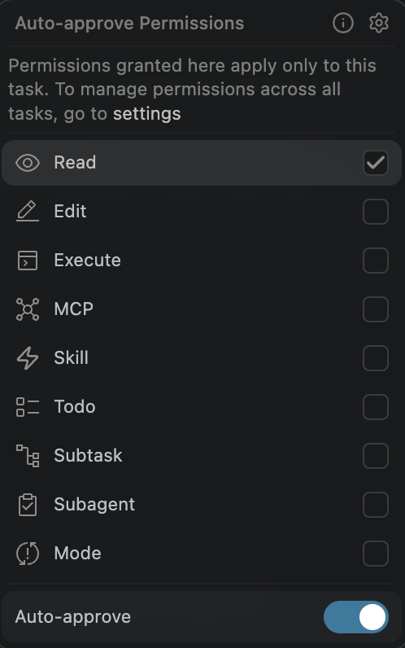

---

# Setting Up

### 1. Open the snapshot subfolder as your project root

Launch your IDE with IBM Bob installed, then open **this exact folder** as the project root:
```
Bobathon/labs/lab1-java-liberty-replatforming/snapA-java-liberty-replatforming
```

> **Important**: The Java Modernization workflow only appears when Bob is opened at the `snapA-*` subfolder, NOT the parent `lab1-*` folder.

If the Bob chat window is not already open, select the Bob icon to the right of the search bar at the top of your IDE.

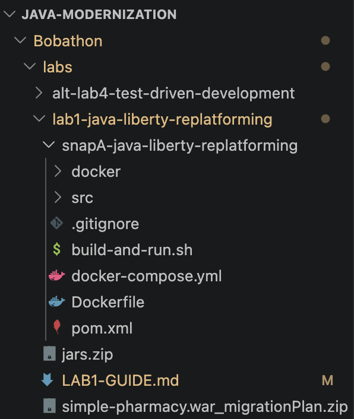

### 2. Confirm Agent mode

In Bob's chat panel, verify the mode indicator at the bottom shows **Agent**. Agent is V2's default mode and replaces V1's `Advanced` and `Code` modes.

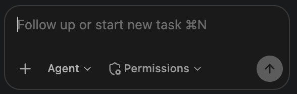

### 3. Confirm the workflow appears

Look for the **Java Modernization** workflow in Bob's chat panel workflow list. If it's not visible, verify your team membership in Bob's settings.


---

# Exercise 1: Run the Liberty Replatforming Workflow

### Objective
Use Bob's Java Modernization workflow to migrate the pharmacy app from Traditional WebSphere to Liberty.

### Steps

1. **Start the workflow**
   - Click on the play button (▶) at the top of the Bob window
   - Select **Java Modernization** from the list of workflows
   - Click **(▶) Start**

2. **Analyze — Analyze Java Project**
   - The project path should auto-populate to the `snapA` folder. Confirm it reads:
     ```
     Bobathon/labs/lab1-java-liberty-replatforming/snapA-java-liberty-replatforming
     ```
   - Leave "Custom build command" blank.
   - Click **Continue**.

   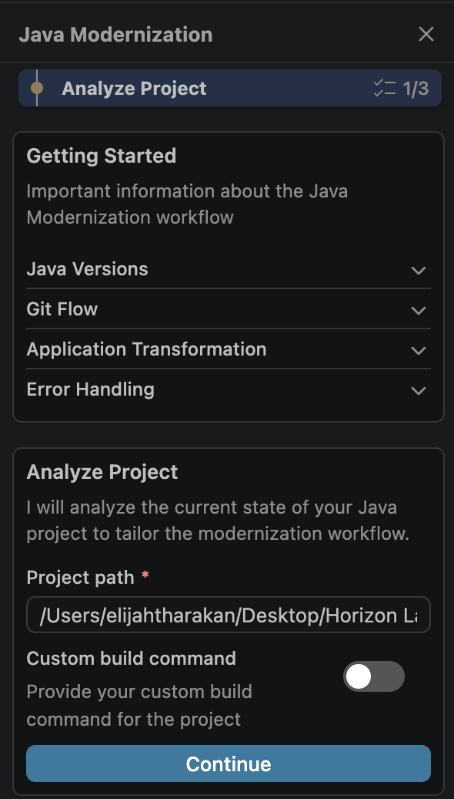

3. **Analyze — Select Modernization Type**
   - Select **Liberty Replatforming**.
   - Toggle **Git Flow** off (Git branch management should be done outside the workflow for this lab).
   - Click **Continue**.

   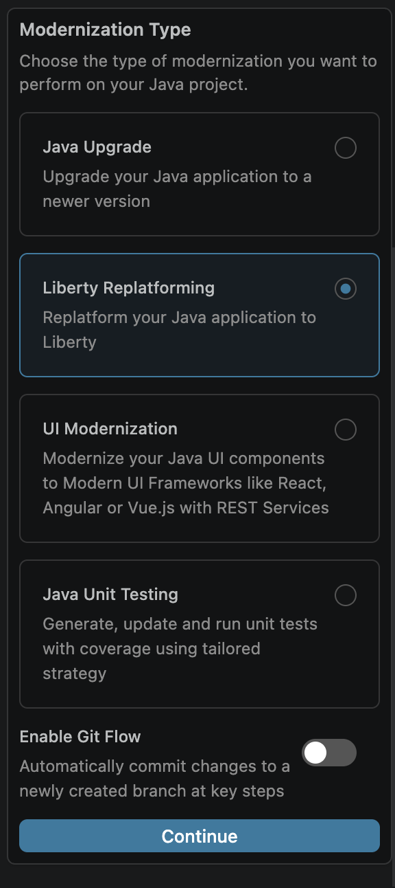

4. **Upgrade — Provide the AMA migration plan**
   - Paste the full path to the migration plan ZIP file:
     ```
     [your local path]/Bobathon/labs/lab1-java-liberty-replatforming/simple-pharmacy.war_migrationPlan.zip
     ```
   - Click **Continue**. Bob will analyze the plan and create a to-do list for modernization.

   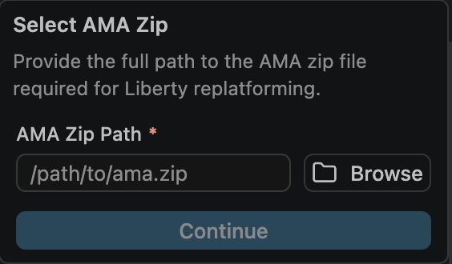

5. **Upgrade — Interactive approval flow**

   Bob will identify migration issues one at a time. For each issue it will:
   - Explain the root cause
   - Propose a specific fix (usually a dependency change or config addition)
   - Ask for your approval before making any change

   You'll typically see three options:
   - `Approve the fix and proceed with implementation`
   - `Do not change dependencies yet; inspect further`
   - `Approve the fix, but show me the exact edits before applying them`

   > **Recommendation**: For the first issue or two, pick **"show me the exact edits before applying them"** to see exactly what Bob is proposing. For subsequent issues, approving directly is fine.

   > **Note**: If you're ever unsure about an action Bob wants to take, review the reasoning that precedes the request, or ask a follow-up question in chat before approving.

   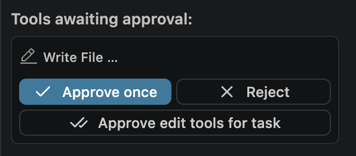

   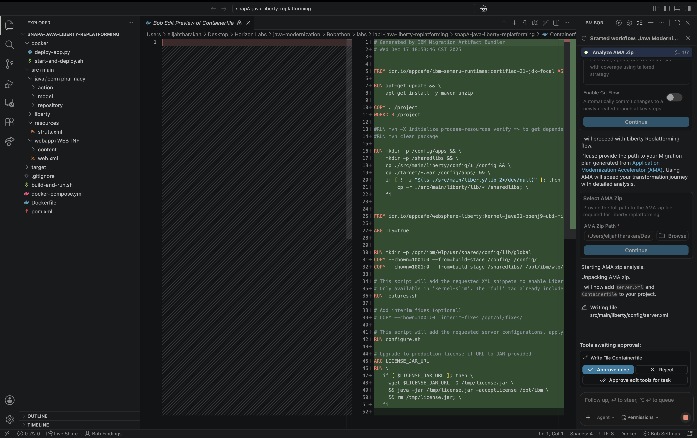

   **Expected issues on this project** (may vary):
   - Javassist charset warning (dependency exclusion + upgrade)

      `Fix "Avoid using default charset when the output stream is a PrintStream" rule` -> `Yes, upgrade javassist to 3.29.2-GA via an explicit dependency override in pom.xml`

   - OGNL SecurityManager conflict (dependency upgrade + JVM options file)

      `Fix "The default value of the java.security.manager system property has been changed to disallow" rule` -> `False positive, no changes necessary.`

6. **Upgrade — Deployment**
   - After all fixes are applied, the workflow will build the app and deploy it to Liberty.
   - Bob will report when the server is running and provide the URLs.

7. **Validate — Modernization summary** ⭐ *V2 feature*
   - Bob generates a **visual modernization summary** showing every step performed, categorized by outcome.
   - Bob also prints **per-task cost and token stats** for the full workflow run.
   - Confirm the workflow reports "started successfully with no errors," or select the appropriate option based on your logs.
   - If there are errors, copy and paste them into the Bob chat for debugging.

   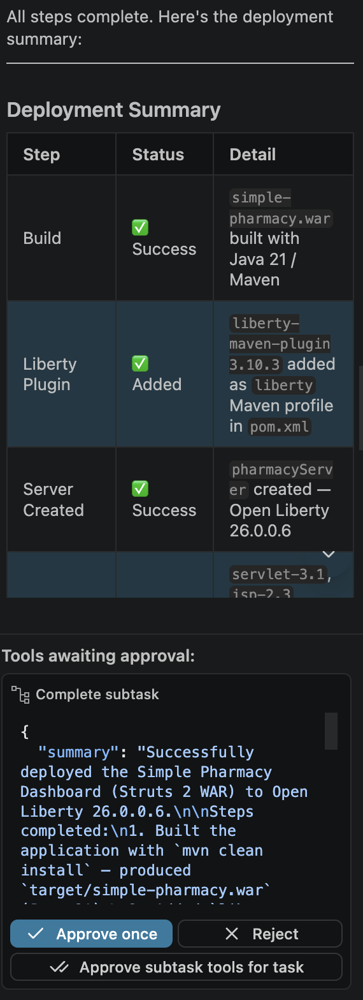

---

# Exercise 2: Verify the Migrated Application

Open a browser and go to:
```
http://localhost:9080/simple-pharmacy.war/
```

If Bob adds an explicit context root (`context-root="/simple-pharmacy"`), then the url will be:
```
http://localhost:9080/simple-pharmacy/dashboard
```


You should see the pharmacy dashboard with data (prescriptions, orders, medicines).

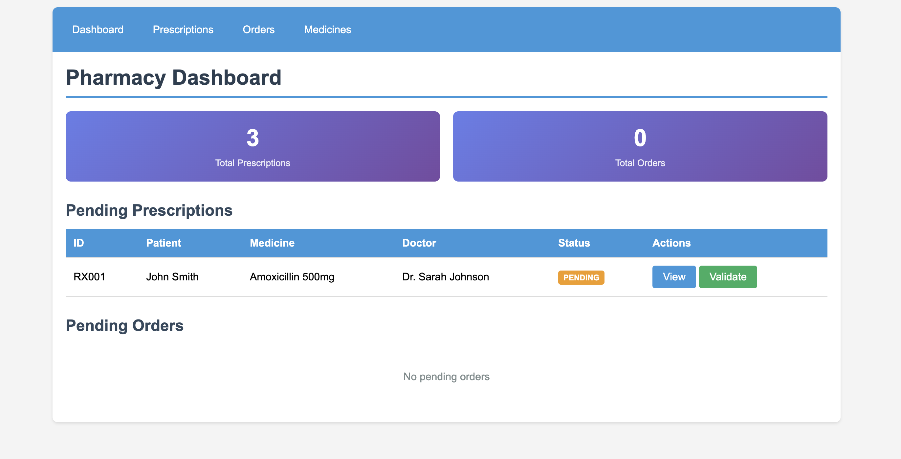


Try navigating to each page to confirm the full app works:
- `http://localhost:9080/simple-pharmacy.war/dashboard`
- `http://localhost:9080/simple-pharmacy.war/prescription-list.action`
- `http://localhost:9080/simple-pharmacy.war/order-list.action`
- `http://localhost:9080/simple-pharmacy.war/medicine-list.action`

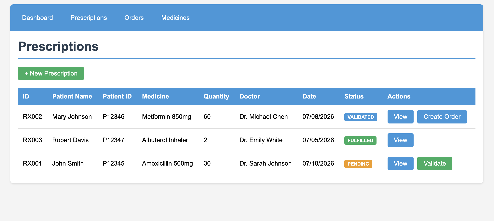

If all pages render correctly, the migration is complete.

---

# Troubleshooting

## Issue 1: Maven Not Found After Installation

**Symptom:**
```
mvn: command not found
```

**Solution:**
1. Verify SDKMAN! installation: `sdk version`
2. Reinstall Maven: `sdk install maven`
3. Fully restart Bob (not just close the window)
4. Open a new terminal and verify: `mvn --version`

---

## Issue 2: Bob Terminal Uses Wrong Java Version

**Symptom:** `java -version` in Bob's terminal shows a different version than expected.

**Solution:** `sdk use java <identifier>` only applies to the shell it was run in — Bob's terminal is a separate shell. Run `sdk use java 8.0.492-zulu` in Bob's terminal specifically, or set the global default with `sdk default java 8.0.492-zulu`.

---

## Issue 3: Bob Can't Read Project Files

**Symptom:** Bob says "I cannot access that file" or "File not found"

**Solution:**
1. Verify you opened the `snapA-java-liberty-replatforming` subfolder as the project root (not the parent `lab1-*` folder)
2. Check file permissions: `ls -la`
3. Ensure Bob has read access to the workspace
4. Try referencing files with `@filename` syntax

---

## Issue 4: Unable to Access JAR File

**Symptom:**
```
Error: Unable to access jarfile /Applications/IBM Bob.app/Contents/Resources/app/extensions/bob-code/assets/jars/ta-jam-2.2.1.jar
```

**Solution:**
1. Create a `jars` folder at `/Applications/IBM Bob.app/Contents/Resources/app/extensions/bob-code/assets/`
2. Add the required JAR files using this structure:
   ```
   ├── jars/
   │   └── prompt-lib/
   │       ├── prompt-lib-2.2.0.jar
   │   └── ta-jam-2.2.1.jar
   ```
3. Close and restart Bob

> ⚠️ **Caution:** Make sure Bob is not running from `/Volumes` (a mounted `.dmg`). Move the IBM Bob app to the `/Applications` folder and run it from there — otherwise it will not be allowed to create folders or place `.jar` files.

---

## Issue 5: `SRVE0321E: The [struts2] filter did not load during start up`

**Symptom:** After Liberty deploys, the log shows a Struts2 filter loading error.

**Solution:** Safe to ignore. The migrated app functions correctly; this message reflects a class-loading side effect that does not affect runtime behavior.

---

## Issue 6: `CWWKS9660E: The orb element with the defaultOrb id attribute requires a user registry`

**Symptom:** ORB-related warning appears in Liberty logs.

**Solution:** Safe to ignore, provided the app doesn't use ORB-based EJB components (this one doesn't).

---

## Issue 7: Workflow proposes a change but you're not sure

**Solution:** Any time Bob offers "show me the exact edits before applying them," pick that option. Bob will render the full diff for your review before touching any files.

---

## Getting Help

1. **Check the Troubleshooting section** — most common issues are covered above
2. **Ask Bob** — Bob can help explain errors and suggest fixes directly in chat
3. **Ask your instructor** — don't hesitate to raise your hand
4. **Collaborate** — discuss with classmates

---

# Conclusion

Congratulations — you've completed the Liberty Replatforming lab using Bob V2's Java Modernization workflow. You should now be comfortable with:

- ✅ Setting up prerequisites (SDKMAN!, Java, Maven)
- ✅ Launching a Bob V2 Java Modernization workflow
- ✅ Navigating the interactive approval flow for each migration change
- ✅ Reading Bob's per-task cost and visual modernization summary output
- ✅ Deploying and verifying a modernized Liberty application

Ready for Lab 2 (Java Upgrade) next.

---
