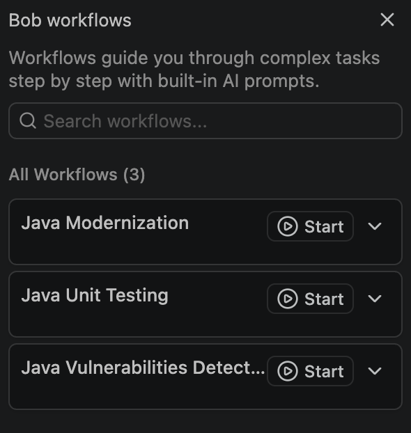
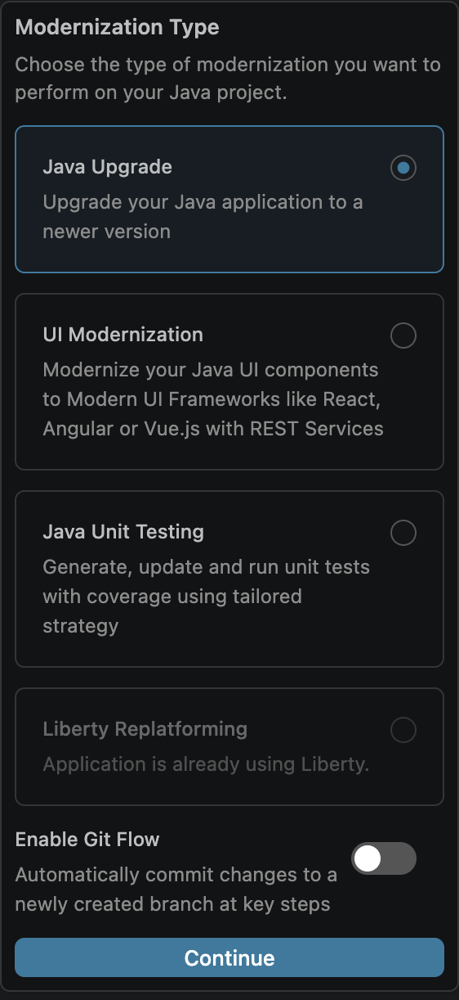
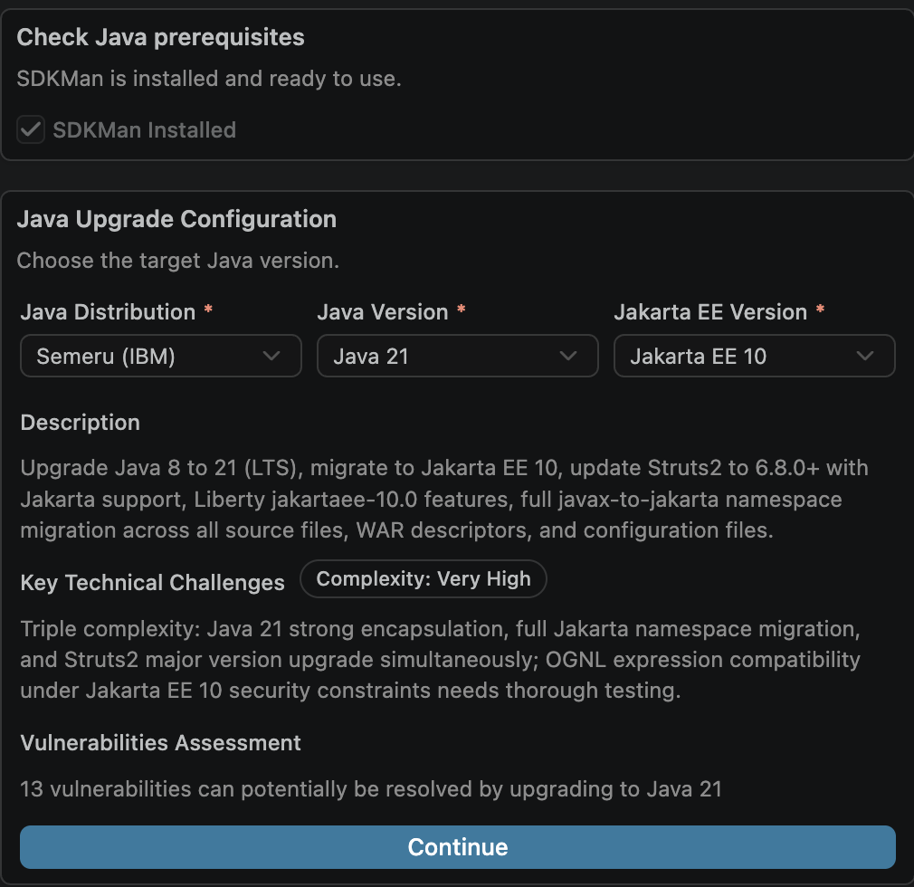
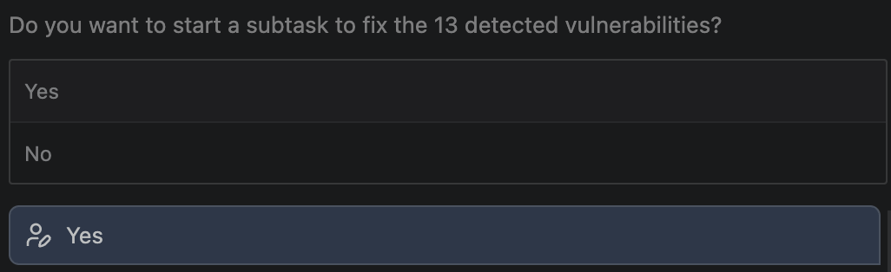

# IBM Bob AI Copilot - Java Upgrade Lab Guide (V2)
## Simple Pharmacy Dashboard - Java 8 to Java 21 Upgrade

---

## Table of Contents
1. [Introduction](#introduction)
2. [Prerequisites](#prerequisites)
3. [V2 Feature Highlights](#v2-feature-highlights)
4. [Java Modernization Workflow Overview](#java-modernization-workflow-overview)
5. [Setting Up](#setting-up)
6. [Exercise 1: Run the Java Upgrade Workflow](#exercise-1-run-the-java-upgrade-workflow)
7. [Exercise 2: Inspect and Verify the Upgrade](#exercise-2-inspect-and-verify-the-upgrade)
8. [Troubleshooting](#troubleshooting)
9. [Conclusion](#conclusion)

---

# Introduction

### What is This Application?

The **Simple Pharmacy Management System** is a web-based application that manages pharmacy operations including:
- **Prescriptions**: Create and validate patient prescriptions
- **Orders**: Process medication orders and payments
- **Medicines**: Manage medicine inventory
- **Dashboard**: Monitor pending prescriptions and orders

### What is a Java Version Upgrade?

Upgrading a Java application from an older LTS version (like Java 8) to a modern LTS version (like Java 21) involves:
- **Namespace changes**: Moving from `javax.*` (Java EE) to `jakarta.*` (Jakarta EE)
- **API changes**: Adopting replacements for removed or deprecated APIs (e.g., SecurityManager, sun.misc.Unsafe)
- **Dependency upgrades**: Bumping libraries that pin to older Java versions
- **Build/config updates**: Updating `pom.xml`, compiler plugin versions, and Jakarta EE targets

## About This Lab

You'll use **Bob V2's Java Modernization workflow** with the **Java Upgrade** sub-type to move the pharmacy app from Java 8 to Java 21 and Jakarta EE 10.

- **Before**: Liberty Runtime, Java 8, Struts 2.5.x
- **After**: Liberty Runtime, Java 21, Struts 7.x, Jakarta EE 10

## Learning Objectives

By the end of this lab, you will:
- Configure a Java Upgrade workflow with target distribution, Java version, and Jakarta EE version
- Observe Bob's mid-workflow CVE scan and remediation prompt
- Understand the interactive approval flow for dependency management changes
- Recognize the major Struts version jump (2.5.x → 7.x) and the ActionSupport import change it triggers
- Review Bob's visual modernization summary and per-task cost/token breakdown

---

# Prerequisites

Before starting this lab, ensure you have the following installed:

### 1. IBM Bob IDE (V2)
- Ensure the latest Bob V2 IDE extension is installed
- You need a Bob subscription tier that includes the Java Modernization workflow suite (the Premium package)
- Log in through Bob to get connected

### 2. SDKMAN! (SDK Manager)

SDKMAN! is a tool for managing parallel versions of multiple Software Development Kits on Unix-based systems.

**Installation Instructions:**
```bash
curl -s "https://get.sdkman.io" | bash
echo '[[ -s "$HOME/.sdkman/bin/sdkman-init.sh" ]] && source "$HOME/.sdkman/bin/sdkman-init.sh"' >> ~/.zshrc
source ~/.zshrc
```

**Verify Installation:**
```bash
sdk version
```

You should see output like: `SDKMAN! 5.x.x`

**For detailed instructions, visit:** https://sdkman.io/install/

### 3. Java 8 — starting state only (Bob will install Java 21)

Java 8 is needed so Bob can compile the starting state cleanly. The Java Upgrade workflow will install the target version (Java 21 Semeru) automatically — you do not need to install Java 21 manually.

> ⚠️ **Apple Silicon note:** Stale identifiers like `8.0.432-tem` no longer exist on SDKMAN, and Temurin 8 is not available on Apple Silicon. Use the Zulu distribution instead.

**Check if Java is already installed:**
```bash
java -version
```

**Find a working Java 8 build:**
```bash
sdk list java | grep " 8\."
```

**Confirmed working on Apple Silicon:** `8.0.492-zulu`
```bash
sdk install java 8.0.492-zulu
sdk use java 8.0.492-zulu
java -version   # should show 1.8
```

> **Note:** Use `sdk use` (not `sdk default`) here — you only need Java 8 active for this shell session. Bob will switch the default to Java 21 once the workflow runs.

### 4. Maven (via SDKMAN!)

```bash
sdk install maven
mvn --version
```

When you run `mvn --version`, it shows the Java version Maven will use. This may differ from your system default — Maven uses the `JAVA_HOME` environment variable or whichever Java SDKMAN! has configured.

### 5. Restart Bob

> ⚠️ **Critical step:** After installing Maven via SDKMAN!, you **must** fully quit and restart Bob for it to pick up the newly installed tools.

**To restart Bob:**
1. Close your IDE completely
2. Reopen your IDE
3. Verify Maven is detected by running `mvn --version` in Bob's terminal

---

# V2 Feature Highlights

Watch for these during the lab — they're worth understanding and demonstrating:

- **Structured config screen** for the upgrade: Java Distribution, target Java Version, and Jakarta EE Version dropdowns (new in V2).
- **Autonomous Java install**: the workflow installs the requested target Java version (Semeru 21) via SDKMAN! without asking — no manual installation needed.
- **Mid-workflow CVE scan**: after applying the upgrade recipes, Bob scans all dependencies for known CVEs and prompts Yes/No to fix them.
- **Interactive approval flow**: each significant `pom.xml` change (e.g. the javassist dependency management block) is proposed with rationale before being applied.
- **Large-scale automated refactor**: the Struts 2.5.x → 7.x jump involves rewriting `com.opensymphony.xwork2.ActionSupport` imports to `org.apache.struts2.ActionSupport` across all action classes — Bob handles this automatically.
- **Per-task cost/token breakdown + visual modernization summary** at the end of the workflow.

---

# Java Modernization Workflow Overview

IBM Bob's Java Modernization workflow follows a structured three-phase process:

* **Analyze**
   * Bob analyzes your Java project and allows you to select a modernization type (Java Upgrade, Liberty Replatforming, or UI Modernization)
* **Upgrade**
   * Bob performs an agentic upgrade of your Java project according to the selected modernization type, addressing issues one at a time with your approval
* **Validate**
   * Bob builds, deploys, and validates the migrated application, then generates a modernization summary

## Controlling Bob's Permissions

You can control what Bob does automatically using the permissions selector in the chat window:
- **Read**: Let Bob read files without asking
- **Edit**: Let Bob modify files without asking
- **Execute**: Let Bob run commands without asking
- **MCP**: Let Bob utilize MCP capabilities without asking
- **Other**: Additional options may be available depending on the task

> 💡 **Tip for first-time users:** Start with only **Read** enabled until you're comfortable, then expand permissions as you gain confidence.

---

# Setting Up

### 1. Open the snapshot subfolder as your project root

Launch your IDE with IBM Bob installed, then open **this exact folder** as the project root:
```
Bobathon/labs/lab2-java-upgrade/snapB-java-upgrade
```

> **Important**: Use the `snapB-*` subfolder, NOT the parent `lab2-*` folder — the Java Modernization workflow only appears at the snapshot level.

Use the application menu bar if needed: **File > Open Folder > navigate to `snapB-java-upgrade/` > Open**

If the Bob chat window is not already open, select the Bob icon to the right of the search bar at the top of your IDE.

### 2. Confirm Agent mode

In Bob's chat panel, verify the mode indicator at the bottom shows **Agent**. Agent is V2's default mode.

### 3. Confirm the workflow appears

Click the play button (▶) at the top of the Bob chat window to open the **Workflows** tab. Look for **Java Modernization** in the list. If it's not visible:
- **Workflow button not available?** Ensure your Bob installation is up to date
- **Can't find workflow in list?** Verify you've opened the correct repository and are on the correct account



---

# Exercise 1: Run the Java Upgrade Workflow

### Objective
Use Bob's Java Modernization workflow to upgrade the pharmacy app from Java 8 to Java 21, migrate to Jakarta EE 10, and remediate security vulnerabilities.

### Steps

#### 1. Start the Workflow

Click the **Start** button on the Java Modernization workflow card to begin.

---

#### 2. Analyze — Analyze Java Project

Bob will display the **Analyze Project** panel.

- Confirm the **Project Path** field is already populated with your current project directory (`snapB-java-upgrade`).
- Leave "Custom build command" blank.
- Click **Continue**.


Bob will scan the project, detect it is a Java 8 application, and perform an initial build to confirm the baseline compiles cleanly.

---

#### 3. Analyze — Select Modernization Type

Bob will present a modernization type selector. Make the following choices:

| Setting | Value |
|---|---|
| **Modernization Type** | Java Upgrade |
| **Git Flow** | Disabled (toggle **off**) |

Click **Continue**.



---

#### 4. Upgrade — Java Upgrade Configuration ⭐ *V2 feature*

Bob will display the Java Upgrade configuration panel. Enter the following settings:

| Setting | Value |
|---|---|
| **Java Distribution** | Semeru (IBM) |
| **Target Java Version** | 21 |
| **Jakarta EE Migration** | Enabled (toggle **on**), target **Jakarta EE 10** |

Click **Run Recipes**.



> **Note:** If Bob detects that Java 21 (Semeru) is not yet installed on your machine, it will prompt you to install it. Click **Install** to allow Bob to install it via SDKMAN! before continuing. The workflow will resume automatically once installation finishes.

Bob will apply the OpenRewrite migration recipes, then run an agentic build pass to resolve any remaining compilation issues.

---

#### 5. Upgrade — Interactive Dependency Approvals ⭐ *V2 feature*

Bob will iterate through issues found in the codebase. For each, it will explain the root cause and propose a fix before making any change. Expected prompts:

- **Javassist POM warning**: Bob proposes adding a `<dependencyManagement>` block to pin javassist and prevent Maven from parsing the broken `3.20.0-GA` POM. **Approve.**
- **Any other dependency conflicts**: typically resolved with additional dependency overrides. Approve as they appear.

---

#### 6. Upgrade — Mid-Workflow CVE Scan ⭐ *V2 feature*

After the initial upgrade and build validation complete, Bob scans all project dependencies against the OSV vulnerability database.

- Bob will report the number of vulnerabilities found (typically **~13 CVEs** across `struts2-core`, `commons-io`, `commons-lang3`).
- When prompted **"Do you want to start a subtask to fix the detected vulnerabilities?"**, click **Yes**.



Bob will:
- Upgrade `struts2-core` from 2.5.x to **7.2.1**
- Upgrade `struts2-convention-plugin`
- Add `commons-io` and `commons-lang3` dependency overrides
- Rewrite ActionSupport imports across all action classes (`com.opensymphony.xwork2` → `org.apache.struts2`)

---

#### 7. Validate — Final Build Verification

Bob runs `mvn clean compile` under Java 21 to confirm the upgraded code builds cleanly. Monitor the output in the chat — you should see `BUILD SUCCESS`.

---

#### 8. Validate — Modernization Summary ⭐ *V2 feature*

Once all subtasks complete, Bob will display a **visual modernization summary**. Review it to confirm:

- ✅ Java version upgraded from **1.8 → 21** (IBM Semeru distribution)
- ✅ Jakarta EE **10** migration applied
- ✅ Build passes with **no errors**
- ✅ Security vulnerabilities **resolved**
- ✅ All changes committed to your branch

Bob also prints a **per-task cost and token breakdown** — total cost is typically ~3–5 Bob coins for this lab. The summary lists the individual commits made during the process.

---

# Exercise 2: Inspect and Verify the Upgrade

### Inspect the diff

Bob's automated namespace changes are a key learning moment. Open a few of the modified files under `src/main/java/com/pharmacy/action/` and look for:

- `import com.opensymphony.xwork2.ActionSupport;` → `import org.apache.struts2.ActionSupport;`
- Any `javax.*` → `jakarta.*` import swaps

### Compile check

In Bob's terminal, confirm Java 21 is now active:
```bash
java -version   # should show 21
```

Then run a clean compile:
```bash
mvn clean compile
```

You should see `BUILD SUCCESS`.

### Run the application

Prompt Bob in the chat to start the application:

> *"Provide me with the commands to run this application."*

Once the application is running, confirm functionality by navigating to:
```
http://localhost:9081/simple.war/dashboard
```

> **Tip:** If you encounter any errors starting the application, paste the output directly into the Bob chat for debugging.

---

# Troubleshooting

## Issue 1: Maven Not Found After Installation

**Symptom:** `mvn: command not found`

**Solution:**
1. Verify SDKMAN! installation: `sdk version`
2. Reinstall Maven: `sdk install maven`
3. Fully restart Bob (not just close the window)
4. Open a new terminal and verify: `mvn --version`

---

## Issue 2: Bob Terminal Still Shows Java 8 After Workflow Installs Java 21

**Symptom:** After the workflow finishes, `java -version` in Bob's terminal still shows `1.8`.

**Solution:** The workflow-installed Java 21 becomes the SDKMAN default. Open a fresh terminal (or run `sdk use java 21.0.11-semeru`) to activate it in your current shell.

---

## Issue 3: Bob Can't Read Project Files

**Symptom:** Bob says "I cannot access that file" or "File not found"

**Solution:**
1. Verify you opened the `snapB-java-upgrade` subfolder as the project root (not the parent `lab2-*` folder)
2. Check file permissions: `ls -la`
3. Ensure Bob has read access to the workspace
4. Try referencing files with `@filename` syntax

---

## Issue 4: Build Errors After Recipe Application

**Symptom:** Bob reports compilation errors after running the OpenRewrite recipes.

**Solution:** Bob will automatically launch a subtask to resolve these errors agentically. Monitor the subtask progress in the chat. If the subtask completes and errors remain, share the full error output with Bob and ask it to investigate further.

---

## Issue 5: Compile Failures After ActionSupport Rewrite

**Symptom:** After the Struts upgrade, `mvn compile` reports "cannot find symbol" errors for `ActionSupport` or related Struts classes.

**Solution:** Bob usually handles all import rewrites automatically. If it missed one, ask Bob in the chat to:
> *"Check for any remaining `com.opensymphony.xwork2` imports and update them to `org.apache.struts2`."*

---

## Issue 6: Jakarta vs javax Confusion

**Symptom:** Runtime errors about missing `javax.servlet.*` or similar.

**Solution:** Under Jakarta EE 10, `javax.*` packages are replaced with `jakarta.*`. Bob rewrites these during the upgrade. If any references remain, ask Bob to:
> *"Audit all imports for remaining `javax.*` references that should be `jakarta.*`."*

---

## Getting Help

1. **Check the Troubleshooting section** — most common issues are covered above
2. **Ask Bob** — Bob can help explain errors and suggest fixes directly in chat
3. **Ask your instructor** — don't hesitate to raise your hand
4. **Collaborate** — discuss with classmates

---

# Conclusion

Congratulations — you've completed the Java Upgrade lab using Bob V2's Java Modernization workflow. You should now be comfortable with:

- ✅ Setting up prerequisites (SDKMAN!, Java 8 starting state, Maven)
- ✅ Launching and configuring the Java Upgrade workflow (Distribution, Version, Jakarta EE)
- ✅ Allowing Bob to apply OpenRewrite recipes and resolve build issues agentically
- ✅ Approving dependency changes through the interactive flow
- ✅ Handling the mid-workflow CVE scan prompt and vulnerability remediation
- ✅ Recognizing large-scale refactors like the Struts 2 → 7 ActionSupport import rewrite
- ✅ Reviewing the final modernization summary and validating the running application

Ready for Lab 3 (UI Modernization) next.

---
