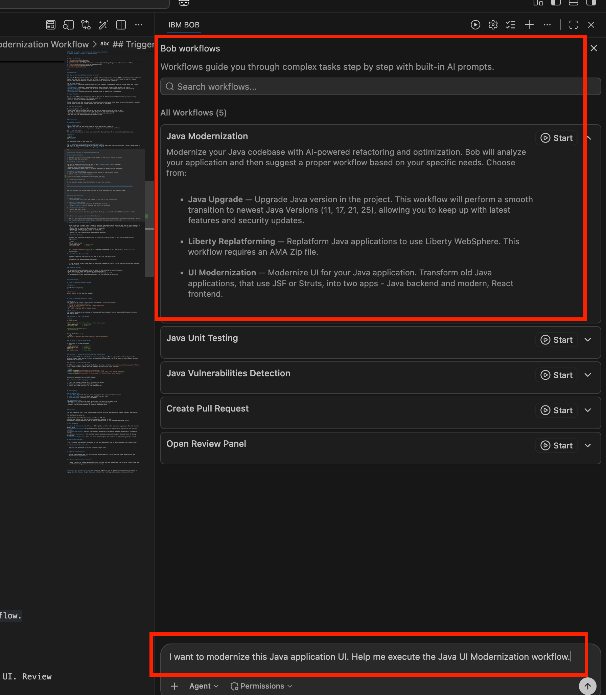
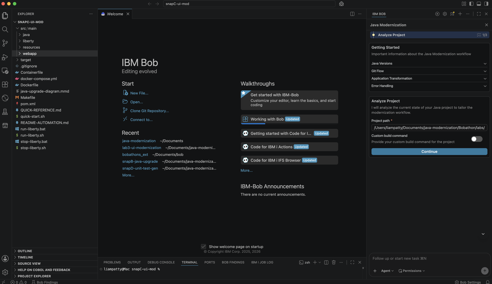
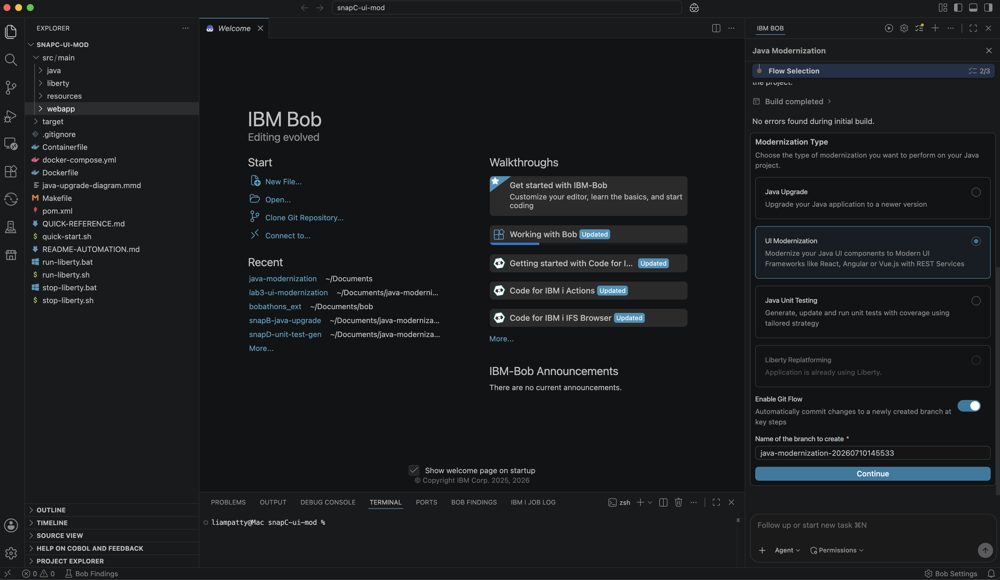
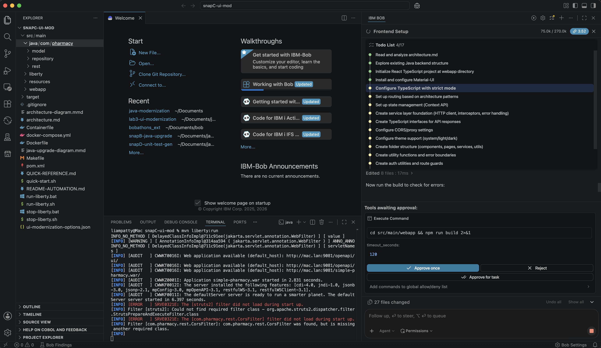
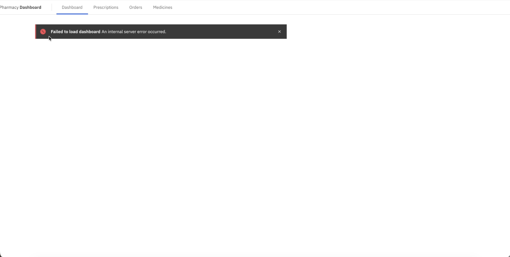
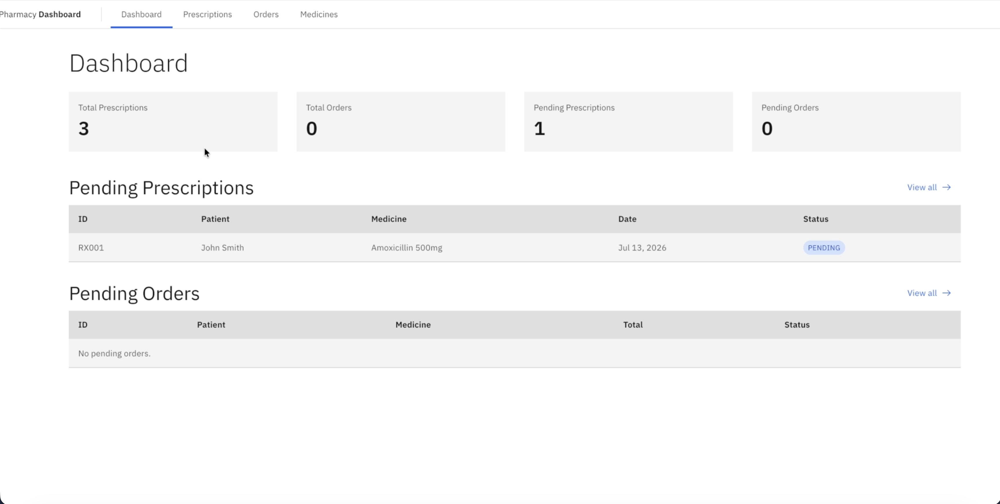

# IBM Bob - Java UI Modernization Workflow
## Simple Pharmacy — Legacy UI Modernization

---

## Table of Contents
1. [Introduction](#introduction)
2. [Prerequisites](#prerequisites)
3. [Initiating the Java UI Modernization Workflow](#initiating-the-java-ui-modernization-workflow)
4. [Step-by-Step Exercises](#step-by-step-exercises)
5. [Troubleshooting](#troubleshooting)
6. [Conclusion](#conclusion)

---

# Introduction

### What is the Java UI Modernization Workflow?

The Java UI Modernization workflow is a guided, AI-assisted process inside IBM Bob that helps teams modernize legacy Java web UIs. In this lab, the workflow is applied to [`snapC-ui-mod`](snapC-ui-mod) — a Simple Pharmacy application whose UI is built on Struts/JSP server-side rendering.

The workflow covers:
- **Analysis**: Examining the existing Struts/JSP codebase — components, routing, state, data, and layout patterns
- **Planning**: Producing a modernization plan and presenting target-state options for the UI
- **Code Generation**: Generating the selected target-state UI and integrating it with the existing application backend
- **Validation**: Running and testing the modernized UI against the live backend

## About This Lab

You will use IBM Bob to initiate and follow the Java UI Modernization workflow on the [`snapC-ui-mod`](snapC-ui-mod) application. The starting point is:
- **UI**: Struts/JSP server-side rendering

During the workflow, Bob will analyze the application and propose one or more target-state options. You will review those options and choose the one you want Bob to implement.

## Learning Objectives

By completing this lab, you will:
- Understand how to initiate and follow the Java UI Modernization workflow in Bob
- Use Bob to analyze a legacy Struts/JSP application and review target-state options
- Guide Bob through generating and refining the selected modernized UI
- Run and test the modernized application end-to-end

---

# Prerequisites

## Required Software

### 1. IBM Bob IDE
- Ensure you have IBM Bob latest version installed and are logged in
- Ensure you have access to **Agent mode** (required to initiate the workflow)

### 2. Java and Maven
The Liberty backend must be built and running for the modernized UI to connect to application data.

**Verify:**
```bash
java -version
mvn -version
```
You should see Java 17+ and Maven 3.x.

### 3. Additional tools based on selected target state
The workflow may recommend a target state that requires additional tools or runtimes. Install those tools if Bob indicates they are needed for the option you select.

---

# Initiating the Java UI Modernization Workflow

The Java UI Modernization workflow provides:
- Multi-file read and write operations
- Complex multi-step workflow execution
- Deep knowledge of legacy Java UI patterns and modern UI modernization approaches

## Opening the Workspace

1. Open the [`snapC-ui-mod`](snapC-ui-mod) folder in Bob as your active workspace.
2. Open the Bob Chat interface.

## Triggering the Workflow

Press the play button `(▶︎)` in the top right near the settings gear, then press `start` on the Java Modernization workflow.

Alternatively, in the Bob chat window, you can type the following to start the workflow:

```
I want to modernize this Java application UI. Help me execute the Java UI Modernization workflow.
```

Bob will initiate the Java UI Modernization workflow and begin with the analysis phase.




---

# Step-by-Step through the workflow

## 1. Analyze Project

Ensure the Project path points to your Java app and press `Continue`. Bob will run an initial build of the app to ensure starting state is working.




## 2. Select `UI Modernization`

Select UI Modernization type. You can also enable or disable git flow. If selected, Bob will create a new git branch for this modernization automatically. Press `Continue`. 

> Important note: Bob will make git commits automatically as he progresses through the workflow



Next, Bob will analyze the application architecture and create documentation in a subtask.

## 3. Select modernization stack

Next, Bob will ask you what stack you want to modernize to. For this lab, select:
- Frontend Framework: `React`
- Frontend Design System: `Carbon Design System`
- Frontent Project Path: `<path_to_project_root>/Bobathon/labs/lab3-ui-modernization/snapC-ui-mod/src/main/webapp`

- Backend Framework: `Spring Boot`
- Backend Project Path: `<path_to_project_root>/Bobathon/labs/lab3-ui-modernization/snapC-ui-mod/src/main/java/com/pharmacy`

And press `Setup Project`

From here, Bob will begin the backend migration in a subtask and track progress via a Todo List. You can press the Todo list item bar at the top of the Bob window to expand or minimize the list.

Bob will run `mvn clean package` to test compilation, identify and debug any errors, fix them, and repeat until the build works.

## 4. Test the new backend

Bob will prompt you to run `mvn spring-boot:run`, do so in your terminal.

Paste any errors into Bob for debugging.

## 5. Frontend Setup / Scaffolding

Next, Bob will work on configuring the new frontend stack, including creating a new vite react app and installing dependencies.

You can track Bob's progress through the Todo list at the top:



When ready, Bob will prompt you to run the frontend via `npm run dev` to check the scaffolding for the project.




## 6. Frontend and Backend Integration

Now Bob will wire the existing frontend components and pages to the backend REST API endpoints. Bob will periodically run build commands to verify the integration. Once complete, run both the backend and frontend together to validate the full end-to-end connection.

### Start the Backend

In a **first terminal**, navigate to the project root and start the Spring Boot backend:

```bash
mvn spring-boot:run
```

Wait until you see the server started message (typically on port `8080`) before starting the frontend.

### Start the Frontend

In a **second terminal**, navigate to the frontend directory and start the Vite dev server:

```bash
npm run dev
```

Then open your browser at http://localhost:3000/ (or the port shown in the terminal output).

If you run into any errors in either terminal, paste them into Bob to debug. The end result should look something like this:



## 7. Validation

Bob should continute to validate the final state of modernization

---

# Conclusion

You have completed Lab 3 — the Java UI Modernization workflow applied to the Simple Pharmacy application.

You should now be able to:

✅ Initiate the Java UI Modernization workflow in IBM Bob  
✅ Review and choose from the target-state options proposed by Bob  
✅ Guide Bob through generating and validating a modernized UI for the selected target state  

## Key Takeaways

1. **Java UI Modernization Workflow** — Bob's guided workflow helps modernize legacy Java UIs with minimal manual setup
2. **Target-State Choice** — The workflow can present multiple UI modernization options for the user to evaluate
3. **Phased Approach** — Analysis → Planning → Generation → Validation produces predictable, reviewable results
4. **Backend Continuity** — The existing Liberty backend continues to support the modernized UI during validation
5. **Iterative Guidance** — Users can guide Bob throughout the workflow to refine the generated result

## Next Steps (Optional)

> The following are optional extensions if you have additional time or want to deepen your exploration.

1. **Optimize the Generated UI**
   ```
   Optimize the generated UI for the selected target state
   ```

2. **Review Code Quality**
   ```
   Review the migrated code for architecture, maintainability, error handling, code organization, and documentation completeness
   ```

3. **Create a Modernization Summary**
   ```
   Create a MIGRATION_SUMMARY.md document that includes what was modernized, the selected target state, key architectural changes, known issues, and next steps
   ```

---

**Thank you for completing Lab 3!** You have used IBM Bob's Java UI Modernization workflow to analyze a legacy Java UI, choose a target state, and validate the resulting modernization outcome end-to-end.
