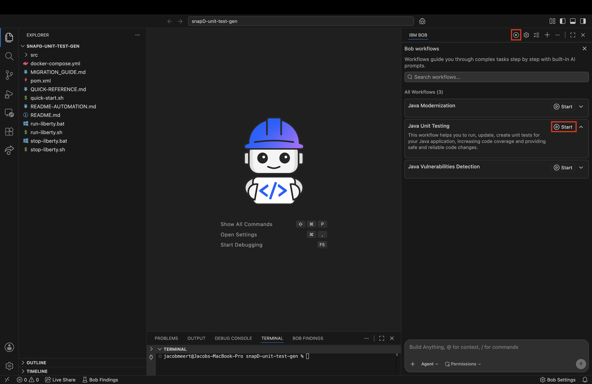
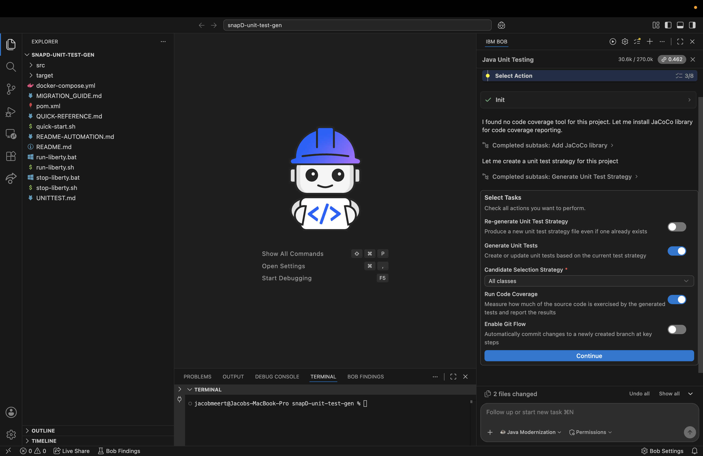
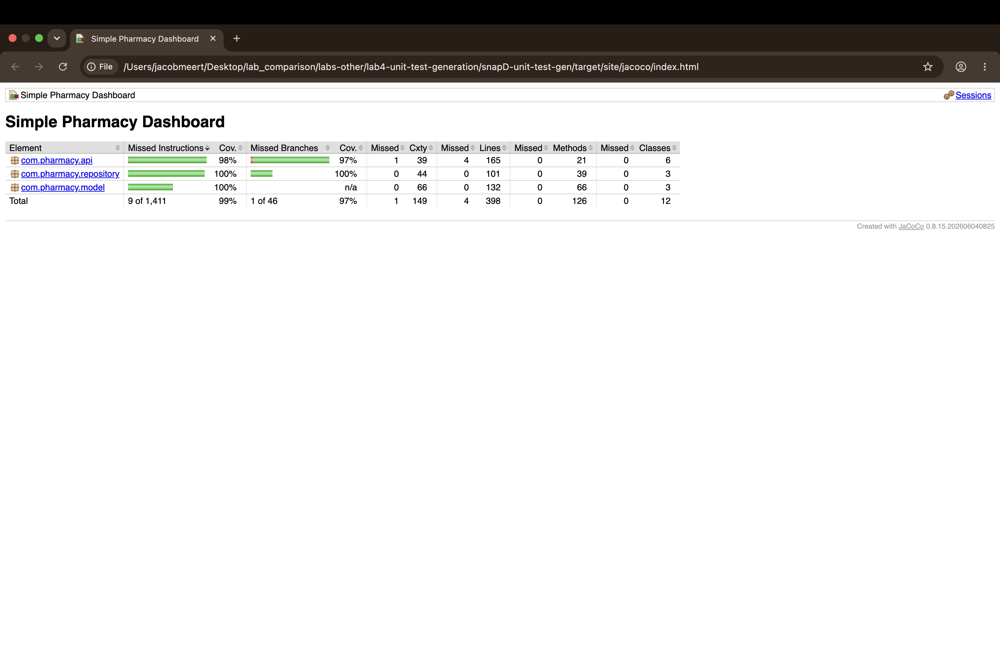

# IBM Bob - Unit Test Generation Lab Guide
## Simple Pharmacy Dashboard - Comprehensive Test Coverage

---

## Table of Contents
1. [Introduction](#introduction)
2. [Prerequisites](#prerequisites)
3. [How the Workflow Works](#how-the-workflow-works)
4. [Auto-Approval Settings](#auto-approval-settings)
5. [Setting Up](#setting-up)
6. [Exercise 1: Run the Java Unit Testing Workflow](#exercise-1-run-the-java-unit-testing-workflow)
7. [Exercise 2: Review the Test Strategy and Results](#exercise-2-review-the-test-strategy-and-results)
8. [Getting Help](#getting-help)
9. [Troubleshooting](#troubleshooting)
10. [Conclusion](#conclusion)

---

# Introduction

### What is Unit Test Generation?

Unit Test Generation is the process of creating automated tests that verify individual components of an application work correctly in isolation. This typically involves:
- **Test Case Design**: Identifying what to test and how to test it
- **Mock Creation**: Isolating units from their dependencies
- **Assertion Writing**: Verifying expected behavior
- **Edge Case Coverage**: Testing boundary conditions and error scenarios
- **Test Organization**: Structuring tests for maintainability

Bob's **Java Unit Testing** workflow automates this entire process — it analyzes your project, drafts a written test strategy, installs JaCoCo for code coverage, generates JUnit 5 tests with Mockito mocks and AssertJ assertions, and runs the generated tests to report a coverage baseline.

## About This Lab

You'll use the standalone **Java Unit Testing** workflow to add a comprehensive test suite to the pharmacy app.

- **Before**: Liberty Runtime, Java 21, Angular frontend, no tests
- **After**: Same codebase, with a JUnit 5 test suite, JaCoCo coverage, and a `UNITTEST.md` strategy file

### Components to Test:
1. **REST API Resources** (PrescriptionResource, OrderResource, MedicineResource, DashboardResource)
   - HTTP endpoint behavior
   - Request/response handling
   - Error scenarios
   - Status code validation

2. **Repository Classes** (PrescriptionRepository, OrderRepository, MedicineRepository)
   - CRUD operations
   - Search and filter functionality
   - Data integrity
   - Concurrent access scenarios

3. **Model Classes** (Prescription, Order, Medicine)
   - Constructor validation
   - Getter/setter behavior
   - Business logic methods

### Testing Technologies:
- **JUnit 5**: Modern testing framework
- **Mockito**: Mocking framework for dependencies
- **Maven Surefire**: Test execution and reporting
- **JaCoCo**: Code coverage instrumentation and reporting

## Learning Objectives

By the end of this lab, you will:
- Launch the standalone Java Unit Testing workflow and select a test generation scope
- Understand each option on the task-selection screen
- Read Bob's `UNITTEST.md` test strategy file and understand what it contains
- Interpret the cost/time preview and 80% confidence interval
- Run the generated test suite with `mvn clean test` and interpret the results
- Generate a JaCoCo code coverage report and read the per-class coverage breakdown

---

# Prerequisites

### 1. IBM Bob IDE
Latest IBM Bob IDE extension installed with the Java premium package on your plan. Ensure you are logged in.

### 2. Terminal Environment (macOS zsh)
Check that SDKMAN is set up:
```bash
sdk version
```

If SDKMAN isn't set up:
```bash
curl -s "https://get.sdkman.io" | bash
echo '[[ -s "$HOME/.sdkman/bin/sdkman-init.sh" ]] && source "$HOME/.sdkman/bin/sdkman-init.sh"' >> ~/.zshrc
source ~/.zshrc
```

### 3. Java 21
List available Java 21 builds:
```bash
sdk list java | grep " 21\."
```

Confirmed working on Apple Silicon: `21.0.11-zulu`.
```bash
sdk install java 21.0.11-zulu
sdk use java 21.0.11-zulu
java -version   # should show 21
```

### 4. Maven
Check if Maven is already installed:
```bash
mvn -v
```

If not, install it:
```bash
sdk install maven
```

**Important Note on Java Versions:**
When you run `mvn -version`, it shows the Java version that Maven will use to build your project. This may differ from your system's default Java version (shown by `java -version`). Maven uses the Java version specified by the `JAVA_HOME` environment variable or the Java installation that SDKMAN has configured. If they differ, set `JAVA_HOME` explicitly or re-run `sdk use java 21.0.11-zulu`.

### 5. Restart Bob
Fully quit and restart Bob after installing Maven so it picks up the new environment.

---

# How the Workflow Works

Before running the workflow it helps to understand what Bob is doing under the hood. The **Java Unit Testing** workflow proceeds in nine phases:

1. **Project Analysis** — Scans the project structure, build tool, and existing test infrastructure (JUnit version, JaCoCo, Surefire plugin) to understand the starting state.

2. **Test Strategy Generation** — Produces a `UNITTEST.md` strategy document defining conventions: naming patterns, mocking approach, isolation rules, and scope.

3. **Task-selection screen** — You choose whether to regenerate the strategy, generate tests, run coverage, and enable Git Flow. Includes a **Candidate Selection Strategy** dropdown (default: All classes).

4. **Cost/time preview** — Before expensive operations, Bob shows the expected duration and Bob-coin cost with an **80% confidence interval** — a rare bit of self-acknowledged variance in AI tooling. This is an estimate, not a guarantee; actual cost typically lands well below the preview.

5. **Test Generation (Batched Subagents)** — Spawns parallel subagents per package/batch, each reading the production class and `UNITTEST.md` to write focused JUnit 5 tests with Mockito mocks where needed.

6. **Build & Dependency Updates** — Adds missing test dependencies (junit-jupiter, mockito-core, mockito-junit-jupiter, JAX-RS runtime for container-free tests) to `pom.xml` as needed.

7. **Self-correcting recovery tasks** — If the workflow hits build issues mid-run (stale class files, compile race conditions, etc.), it adds unplanned recovery subtasks and fixes them without user prompting.

8. **Test Execution & Validation** — Runs `mvn test` and fixes any failures before proceeding, ensuring a green suite throughout.

9. **Coverage Reporting** — Runs the full suite with JaCoCo enabled and surfaces per-class instruction coverage, highlighting any remaining gaps.

---

# Auto-Approval Settings

You can control what Bob does automatically using the permissions selector in the chat window:
- **Read**: Let Bob read files without asking
- **Edit**: Let Bob modify files without asking
- **Execute**: Let Bob run commands without asking
- **MCP**: Let Bob utilize MCP capabilities without asking
- **Other**: A number of other options may be available depending on the task at hand

> **Tip for new users:** Start with only "Read" enabled until you are comfortable, then enable additional permissions as you grow confident in what Bob is doing.

---

# Setting Up

### 1. Open the snapshot subfolder as your project root

- Launch IBM Bob
- Use the application menu bar: **File > Open Folder**
- Navigate to the **`snapD-unit-test-gen/`** subfolder and click **Open**

> Use the `snapD-*` subfolder as your root, not the parent `lab4-*` folder.

### 2. Confirm Agent mode
Bob's chat panel should show **Agent** at the bottom.

### 3. Confirm the workflow appears
Look for **Java Unit Testing** in Bob's chat panel workflow list (it is a top-level workflow, not nested inside another).

---

# Exercise 1: Run the Java Unit Testing Workflow

### 1. Start the workflow

- Click on the play button (▶) at the top of the Bob window
- Select **Java Unit Testing** from the list of workflows
- Click (▶) **Start**



### 2. Automatic setup

Bob will immediately begin exploring the repository without prompting you:
- Detect that no code coverage tool is configured
- Install JaCoCo into `pom.xml`
- Read through the codebase to develop a testing strategy
- Draft the test strategy as `UNITTEST.md`

No approval prompts appear during this phase — this is expected. Bob will launch subtasks as it works; confirm each action to maintain visibility into what Bob is doing.

> **Note:** If a subtask ends and you are satisfied with the output, click **End Subtask** to return to the main workflow.

### 3. Task selection screen

Once Bob finishes drafting `UNITTEST.md`, the task-selection screen appears. Fill it in as follows:

| Setting | Value |
|---|---|
| **Re-generate Unit Test Strategy** | Off (Bob just drafted one) |
| **Generate Unit Tests** | On |
| **Candidate Selection Strategy** | All Classes |
| **Run Code Coverage** | On |
| **Enable Git Flow** | Off |

Click **Continue**.




### 4. Cost/time preview

Bob shows something like:
> *"I will generate unit tests for 12 classes in 4 batches. For each batch, I expect a duration of 3 minutes and cost of 2.8 Bob coins (80% of batches finish within these limits)."*

Note the **80% confidence interval** phrasing — Bob is acknowledging that one in five batches may take longer or cost more. Click **Proceed with test generation**.

### 5. Batch generation

Bob generates tests in batches organized by package, using subagents with isolated contexts:
- `com.pharmacy.repository` (3 classes)
- `com.pharmacy.api` — first batch (1 class)
- `com.pharmacy.model` (3 classes)
- `com.pharmacy.api` — remaining classes (5 classes)

If Bob hits build issues mid-run (stale `.class` files, incremental compile race), it will add recovery subtasks and fix them autonomously.

### 6. Test execution and coverage report

After all batches complete, Bob runs `mvn test` and reports pass/fail counts, then generates a JaCoCo coverage report. If a report is not automatically surfaced, ask Bob:
```
please generate a JaCoCo coverage report
```

### 7. Workflow summary

Bob prints a per-task cost breakdown and a modernization summary graphic. Typical actual cost lands well under the preview (e.g. ~4.5 coins vs an ~11 coin preview).

---

# Exercise 2: Review the Test Strategy and Results

### 1. Read `UNITTEST.md`

Open `UNITTEST.md` at the project root. Bob's strategy document covers:
- Application architecture summary
- Testable classes and their responsibilities
- Naming conventions
- Test file paths
- Coverage thresholds (goals, not guarantees)
- Identified gaps prioritized as P1/P2/P3

### 2. Run the test suite yourself

In Bob's terminal:
```bash
mvn clean test
```

Confirm the same pass rate Bob reported.

### 3. Open the coverage report

```bash
mvn jacoco:report
open target/site/jacoco/index.html
```

Compare the package-level coverage numbers to Bob's reported baseline. Your report should look something like this:



### 4. Explore a generated test file

Open a few generated test files (e.g. `src/test/java/com/pharmacy/repository/PrescriptionRepositoryTest.java`) and note:
- Use of `@ExtendWith(MockitoExtension.class)`
- `@Mock` and `@InjectMocks` annotations
- AssertJ fluent assertions

If repositories use the singleton pattern, look for how Bob mocks it — a common technique is `MockedStatic` combined with reflection to overwrite the private singleton field.

You can also spot-check a few of the tests to confirm they follow sound conventions: clear names, isolated cases, and meaningful assertions.

---

# Getting Help

### During the Lab
1. **Ask Bob** — Bob can explain testing concepts, fix failing tests, and review generated code
2. **Ask Your Instructor** — Don't hesitate to raise your hand
3. **Collaborate** — Discuss testing approaches with classmates

### Bob-Specific Tips
- Pay attention to the actions Bob takes as it executes the workflow to build your understanding
- Ask Bob to explain any testing patterns that are unclear
- Request an analysis of how effective the test suite is after generation
- Use Bob to review and improve individual tests

---

# Troubleshooting

## Issue 1: API Request Failed

**Symptom:**
```
{"apiProtocol":"openai"}
```

**Solution:**
Select **Retry** in the Bob chat window.

---

## Issue 2: `mvn test` reports "cannot find symbol" or missing classes

**Symptom:** Test classes reference source classes Bob thinks exist but the compile step disagrees.

**Solution:** Stale `.class` files from a prior run can cause this. Run `mvn clean test` (not just `mvn test`) to force a full recompile.

---

## Issue 3: Mock Injection Failures

**Symptom:**
```
NullPointerException in tests when accessing mocked objects
```

**Solution:**
1. Ensure `@ExtendWith(MockitoExtension.class)` is present on the test class
2. Verify `@Mock` and `@InjectMocks` annotations are correct
3. Check that mocks are initialized in `@BeforeEach` if not using the extension
4. Ask Bob to review the mock setup

---

## Issue 4: Tests Fail Due to Singleton State

**Symptom:** Tests pass individually but fail when run together.

**Solution:**
1. Repository singletons maintain state between tests
2. Add reset methods to repositories or use reflection to reset instances
3. Ask Bob to implement proper test isolation
4. Consider using `@TestInstance(Lifecycle.PER_CLASS)` with proper cleanup

---

## Issue 5: JaCoCo Coverage Report Not Generated

**Symptom:** No `target/site/jacoco/` directory after the run.

**Solution:** Run `mvn clean test jacoco:report`. The coverage report requires the `jacoco:report` goal explicitly — it is not produced by `mvn test` alone.

---

## Issue 6: Bob's Terminal Shows the Wrong Java Version

**Symptom:** `java -version` in Bob's terminal shows Java 8 (or another version) instead of 21.

**Solution:** Run the following in Bob's terminal specifically:
```bash
sdk use java 21.0.11-zulu
```
`sdk use` is shell-scoped — it does not apply across terminal tabs or to the terminal Bob opens independently. You must run it in each shell where you intend to use that Java version.

---

# Conclusion

Congratulations! You've completed the Unit Test Generation lab using Bob's Java Unit Testing workflow. You should now be comfortable with:

- ✅ Launching the standalone Java Unit Testing workflow
- ✅ Configuring the task-selection screen (strategy, tests, coverage, Git flow)
- ✅ Interpreting Bob's cost/time preview with its 80% confidence interval
- ✅ Reviewing the `UNITTEST.md` strategy document and understanding its structure
- ✅ Running the test suite yourself with `mvn clean test`
- ✅ Generating a JaCoCo coverage report and reading the per-class breakdown

Ready for Lab 5 (Vulnerabilities Detection) next.

## Key Takeaways

1. **Test Early, Test Often** — Automated tests catch bugs before they reach production
2. **Comprehensive Coverage** — Test success paths, error paths, and edge cases
3. **Proper Isolation** — Use mocks to test units without real dependencies
4. **Readable Tests** — Clear test names and assertions make maintenance easier
5. **Fast Execution** — Unit tests should run quickly to encourage frequent use
6. **Bob's Testing Expertise** — AI can generate comprehensive test suites efficiently, but reviewing and understanding the output is part of the process

## Test Suite Achievements

### Coverage Metrics:
- ✅ **Overall Coverage** — Success if above 80%

### Test Categories:
- ✅ **Happy Path Tests** — Verify normal operation
- ✅ **Error Handling Tests** — Verify proper error responses
- ✅ **Edge Case Tests** — Verify boundary conditions
- ✅ **Integration Tests** — Verify component interactions

---

## Optional Extensions

> **Note:** The following activities are optional. Explore them if you have additional time or want to deepen your understanding of test quality and coverage.

### 1. Performance Testing

Ask Bob:
```
Create performance tests that measure:
- Response time for API endpoints under load
- Repository operation performance with large datasets
- Memory usage during concurrent operations

Use JMH (Java Microbenchmark Harness) for accurate measurements.
```

### 2. Contract Testing

Ask Bob:
```
Implement API contract tests using REST Assured to verify:
- Request/response schemas
- HTTP status codes
- Content-Type headers
- JSON structure validation
```

### 3. Mutation Testing

Ask Bob:
```
Add PIT (Mutation Testing) to the project to verify test quality.
Configure it in pom.xml and analyze mutation coverage reports.
Improve tests based on surviving mutants.
```

### 4. Test Data Builders

Ask Bob:
```
Create test data builder classes for:
- Prescription objects
- Order objects
- Medicine objects

Use the Builder pattern to make test data creation more readable and maintainable.
```

### 5. Parameterized Tests

Ask Bob:
```
Convert repetitive tests to parameterized tests using JUnit 5's @ParameterizedTest.
Focus on tests that verify similar behavior with different inputs.
```

### 6. Testcontainers (Advanced)

Ask Bob:
```
If we add a database in the future, set up Testcontainers for:
- Running tests against a real database in Docker
- Ensuring tests are isolated and repeatable
- Testing database-specific behavior
```

---

**Thank you for completing this lab!** You've successfully used IBM Bob to generate a comprehensive unit test suite for a Java application. This experience demonstrates how Bob can accelerate test creation while ensuring high quality, maintainability, and coverage. Remember: good tests are the foundation of reliable software!
