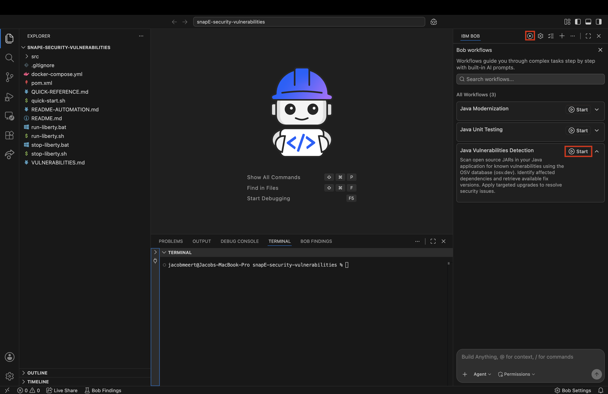
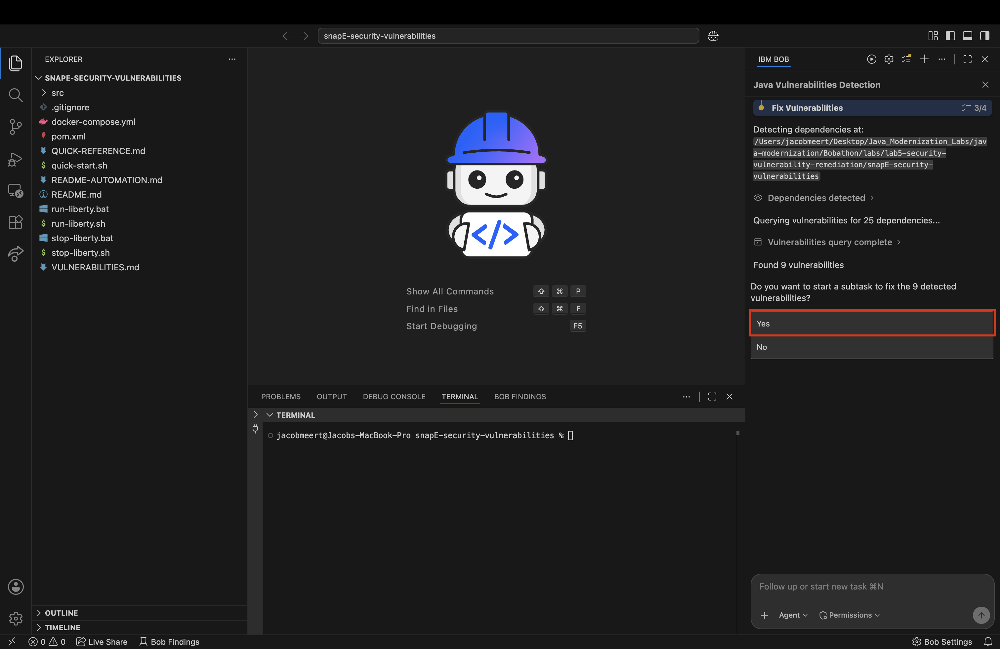
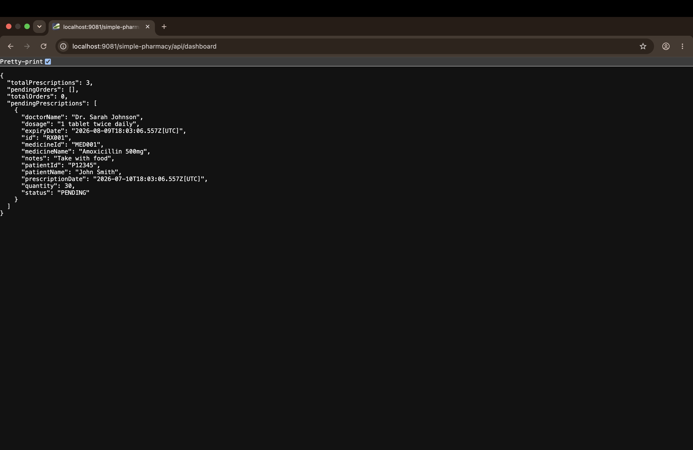
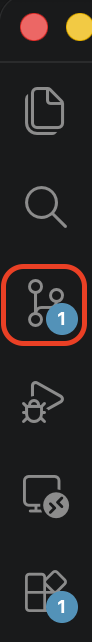
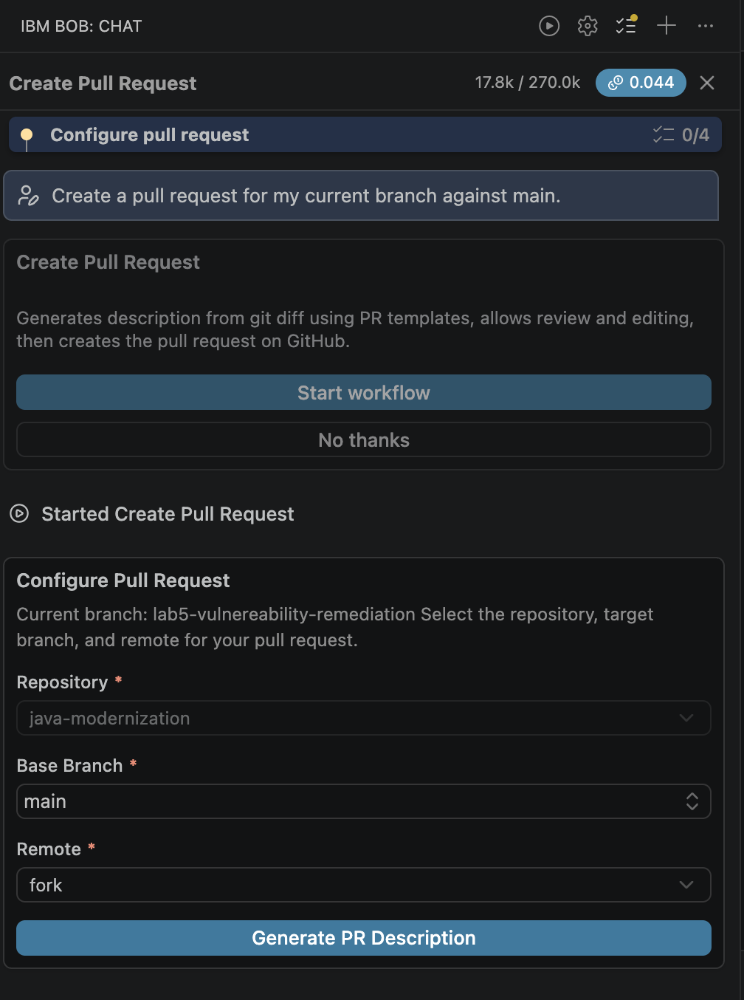
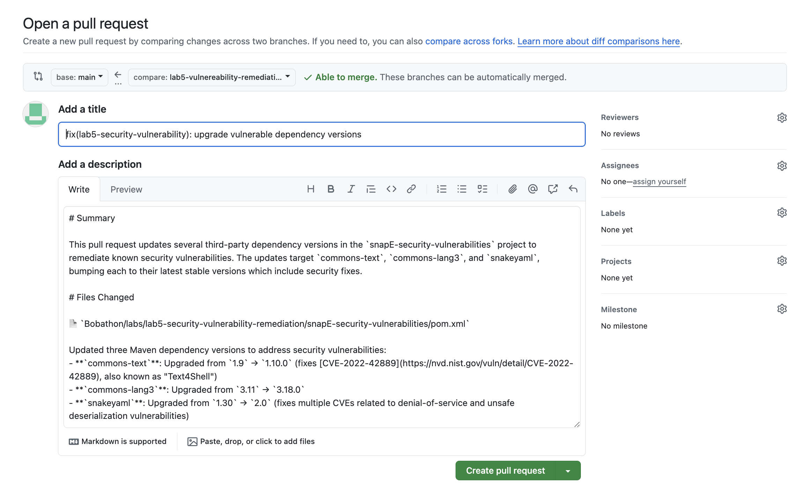

# IBM Bob AI Copilot - Java Vulnerabilities Detection Lab Guide (V2)
## Simple Pharmacy Dashboard - Dependency CVE Scanning & Remediation

---

## Table of Contents
1. [Introduction](#introduction)
2. [Prerequisites](#prerequisites)
3. [V2 Feature Highlights](#v2-feature-highlights)
4. [Setting Up](#setting-up)
5. [Exercise 1: Run the Vulnerabilities Detection Workflow](#exercise-1-run-the-vulnerabilities-detection-workflow)
6. [Exercise 2: Review the CVE Findings](#exercise-2-review-the-cve-findings)
7. [Exercise 3: Remediate the Detected Vulnerabilities](#exercise-3-remediate-the-detected-vulnerabilities)
8. [Exercise 4: Verify the Remediated Application](#exercise-4-verify-the-remediated-application)
9. [Exercise 5: Commit Fixes and Create a Pull Request](#exercise-5-commit-fixes-and-create-a-pull-request)
10. [Troubleshooting](#troubleshooting)
11. [Conclusion](#conclusion)

---

# Introduction

### What is Dependency Vulnerability Detection?

Every Java application depends on third-party libraries — directly (declared in `pom.xml`) or transitively (pulled in by another library). Any of those libraries can carry known security vulnerabilities cataloged as CVEs. Dependency vulnerability detection is the process of:

- **Scanning** your project's declared and transitive dependencies
- **Matching** them against published CVE databases
- **Reporting** each match with severity, affected versions, and fix recommendations
- **Remediating** by upgrading or excluding the vulnerable dependency

## About This Lab

You'll use **Bob V2's Java Vulnerabilities Detection workflow** to scan the pharmacy application's dependencies, understand each finding, remediate them by upgrading vulnerable libraries, and finally capture the fixes in a pull request using Bob's **Create Pull Request** workflow.

- **Before**: pharmacy application with vulnerable dependency versions in `pom.xml`
- **After**: same application with vulnerable dependencies upgraded, clean scan result, and a documented remediation trail committed to a dedicated branch with a pull request raised against the upstream repository

## Learning Objectives

By the end of this lab, you will:
- Launch the Java Vulnerabilities Detection workflow and interpret its scan output
- Understand the difference between direct and transitive dependency vulnerabilities
- Approve dependency upgrades through Bob's interactive remediation flow
- Verify the remediated application still builds cleanly
- Fork the shared repository, commit the remediation changes to a branch, and push to your fork
- Use Bob's Create Pull Request workflow to generate a PR description and raise the PR against the upstream repository

---

# Prerequisites

### 1. IBM Bob IDE (V2)
- Latest Bob V2 IDE extension installed
- Bob subscription tier that includes the Java Vulnerabilities Detection workflow (the Premium package)

### 2. Terminal Environment (macOS zsh)
If SDKMAN isn't set up:
```bash
curl -s "https://get.sdkman.io" | bash
echo '[[ -s "$HOME/.sdkman/bin/sdkman-init.sh" ]] && source "$HOME/.sdkman/bin/sdkman-init.sh"' >> ~/.zshrc
source ~/.zshrc
```

### 3. Java 21
```bash
sdk list java | grep " 21\."
```
Confirmed working on Apple Silicon: `21.0.11-zulu`.
```bash
sdk install java 21.0.11-zulu
sdk use java 21.0.11-zulu
```

### 4. Maven
```bash
sdk install maven
```

### 5. Restart Bob
Fully quit and restart Bob after installing Maven.

*Note: this lab is backend-only. Node.js and npm are not required.*

---

# V2 Feature Highlights

Worth watching for and demonstrating during this lab:

- **Standalone workflow at the top level**: Java Vulnerabilities Detection is a dedicated top-level workflow — not a sub-type inside Java Modernization.
- **Fast, deterministic scan**: unlike the modernization workflows (which are agentic and iterative), the vulnerabilities scan is a targeted CVE lookup that completes in seconds.
- **Direct + transitive scope**: Bob resolves the full dependency tree, not just what's directly declared in `pom.xml`. Transitive vulnerabilities are reported alongside direct ones.
- **Interactive remediation flow**: for each detected CVE, Bob proposes a specific fix (usually a version bump or dependency swap) and asks for approval before applying.
- **Per-task cost breakdown**: even short workflow runs show the per-task cost and token accounting.

---

# Setting Up

### 1. Open the snapshot subfolder as your project root
```
Bobathon/labs/lab5-security-vulnerability-remediation/snapE-security-vulnerabilities
```
Use the `snapE-*` subfolder, not the parent `lab5-*` folder — the workflow only appears at the snapshot level.

### 2. Confirm Agent mode
Bob's chat panel should show **Agent** at the bottom.

### 3. Confirm the workflow appears
Look for **Java Vulnerabilities Detection** in Bob's chat panel workflow list.

---

# Exercise 1: Run the Vulnerabilities Detection Workflow

### Objective
Trigger the workflow and let Bob perform a full dependency scan.

### Steps

1. **Start the workflow**
   - In Bob's chat panel, click **Start** on the **Java Vulnerabilities Detection** workflow.

   

2. **Dependency detection**
   Bob reads `pom.xml`, resolves the full dependency tree (direct + transitive), and reports the number of packages it will scan.

3. **CVE lookup**
   Bob queries the CVE database for each detected package. This step is fast — typically under 30 seconds for a project of this size.

4. **Findings report**
   Bob reports each detected vulnerability with:
   - Affected package and version
   - CVE identifier(s)
   - Severity (Critical, High, Medium, Low)
   - Whether the dependency is direct or transitive
   - Suggested remediation

---

# Exercise 2: Review the CVE Findings

### Objective
Understand what Bob found and prioritize before remediating.

### Steps

1. **Read through each finding**
   For every CVE, note:
   - Is the vulnerable library directly declared or pulled in transitively?
   - What's the fixed version Bob recommends?
   - What's the severity, and does it apply to how your app actually uses the library?

2. **Group the findings**
   Ask yourself:
   - Which findings are quick fixes (single version bump)?
   - Which require excluding a transitive dependency and adding a direct replacement?
   - Are any duplicates caused by multiple paths bringing in the same vulnerable version?

3. **Confirm you understand each CVE before remediating**
   For unfamiliar CVEs, ask Bob directly in the chat: `Explain CVE-XXXX-XXXX in plain terms and how it could affect this application.` Bob will summarize the vulnerability and its practical impact.

---

# Exercise 3: Remediate the Detected Vulnerabilities

### Objective
Apply Bob's proposed fixes through the interactive remediation flow.

### Steps

1. **Start remediation**
   From the findings report, tell Bob to proceed with remediation. Bob will step through the CVEs one at a time.

   

2. **Interactive approval flow**
   For each finding, Bob will:
   - Explain the CVE and its impact
   - Propose a specific `pom.xml` change (version bump, exclusion + direct dependency, `<dependencyManagement>` pin, etc.)
   - Ask for approval before applying

3. **Preview individual edits**
   If you're not sure about a proposed change, choose the option to see the exact `pom.xml` edits before applying. Bob will render the diff for review.

4. **Approve iteratively**
   Work through each CVE in the order Bob presents them. Bob will apply each edit, then move on to the next.

5. **Handle knock-on effects**
   Some fixes trigger secondary issues (e.g. an upgrade to a new major version that requires an API change elsewhere). Bob will identify these and prompt for approval on additional fixes.

---

# Exercise 4: Verify the Remediated Application

### Objective
Confirm the app still builds and re-scan to confirm the CVEs are cleared.

### Steps

1. **Compile check**
   In Bob's terminal:
   ```bash
   mvn clean compile
   ```
   You should see `BUILD SUCCESS`.

2. **Re-run the workflow**
   Click **Start** on the Java Vulnerabilities Detection workflow again. Bob should now report either zero findings or a substantially reduced list.

3. **Optional: run the Liberty server**
   ```bash
   mvn liberty:run
   ```
   Confirm the api comes up cleanly on `http://localhost:9081/simple-pharmacy/api/dashboard` with no runtime errors introduced by the upgrades. It should look something like this:

   

---

# [Bonus] Exercise 5: Commit Fixes and Create a Pull Request

### Objective
Capture the remediated `pom.xml` changes in a branch and raise a pull request so the fixes can be reviewed and merged.

> **Scope:** Only commit changes made inside `labs/lab5-security-vulnerability-remediation/snapE-security-vulnerabilities/`.
> Do **not** stage files from other labs or the repository root.

### Steps

1. **Fork the shared repository**

   Because this is a shared Bobathon repository, you cannot push branches directly to it. You must first create your own fork on GitHub.

   a. Go to the repository on [GitHub](https://github.com/tecksheng14/java-modernization).

   b. Click the **Fork** button (top-right corner of the repository page).

   c. Select your own GitHub account as the destination. Leave all defaults and click **Create fork**.

   d. Once the fork is created, copy your fork's HTTPS or SSH clone URL from the **Code** button on your fork's page.

2. **Clone your fork locally**

   If you already have the original repository cloned, add your fork as a remote and fetch from it:
   ```bash
   git remote add fork <your-fork-url>
   git fetch fork
   ```

   If you haven't cloned the repository yet, clone your fork now:
   ```bash
   git clone <your-fork-url>
   cd java-modernization
   ```

   > **Tip:** You can verify your remotes at any time with `git remote -v`. You should see `origin` pointing to the shared repo and `fork` (or `origin` if you cloned your fork directly) pointing to your personal fork.

3. **Create a branch**

   ```bash
   git checkout -b lab5-vulnerability-remediation
   ```

4. **Stage only the lab files**

   Make sure you are in the snapshot directory first, then add only the files that were changed during remediation:
   ```bash
   git restore --staged ../../../
   git add .
   ```
   
   Verify the staged set looks correct before committing:
   ```bash
   git status
   git diff --cached
   ```
   **Do not run `git add .` from the repository root** — that would sweep in changes from other labs.

5. **Commit with a descriptive message**

   You can write the commit message manually:
   ```bash
   git commit -m "lab5: remediate dependency CVEs (snakeyaml, commons-text, log4j, etc.)"
   ```

   Or use the **Generate Commit Message** button in your IDE's source control panel to auto-generate one from the diff.

   Either way, include a brief description of what was fixed.

6. **Create the Pull Request via Bob**

   > **Before proceeding:** confirm that the **Create Pull Request** workflow is visible in Bob's workflow list. This workflow is only available when the repository is opened inside the source control panel inside the IDE. If the workflow is missing, reopen the Bob window with the repository root as the workspace, then return to this step.
   
   

   Ask Bob to create the pull request.
   ```
   Create a pull request from my current branch against main.
   ```

   Bob will launch the **Create Pull Request** workflow, which:
   - Diffs the branch against `main`
   - Generates a PR title and description from the commit messages and changed files
   - Lets you review and edit the description before submitting
   - Creates the PR on GitHub

   

7. **Verify the PR**

   Open the PR link Bob to view the drafted:
   - Only files under `snapE-security-vulnerabilities/` appear in the diff
   - The description lists the CVEs that were resolved

   


---


# Troubleshooting

## Issue 1: Workflow reports zero vulnerabilities

**Symptom:** Bob's scan completes with "No vulnerabilities found affecting the detected packages."

**Solution:** This can be a legitimate result (clean dependencies), but for this lab it means `pom.xml` doesn't include the intentionally vulnerable versions the lab expects. Check that you opened the `snapE-*` starting snapshot and haven't modified it.

## Issue 2: `mvn compile` fails after a version bump

**Symptom:** A CVE remediation upgrades a library to a version with a breaking API change, and the code no longer compiles.

**Solution:** Paste the compile error back to Bob and ask it to reconcile the API change. Bob will either adapt the calling code or propose a different (still-secure) version.

## Issue 3: A vulnerable dependency is pulled in transitively and won't upgrade cleanly

**Symptom:** A CVE lives inside a transitive dependency that Bob can't simply version-bump because another library requires the older version.

**Solution:** Bob typically proposes an `<exclusions>` block on the outer dependency plus a direct declaration of the fixed version. Approve when prompted.

## Issue 4: Bob's terminal shows the wrong Java version

**Symptom:** `java -version` in Bob's terminal shows a version other than 21.

**Solution:** `sdk use java 21.0.11-zulu` in Bob's terminal specifically. `sdk use` is shell-scoped and doesn't apply across terminal tabs.

---

# Conclusion

You've completed the Java Vulnerabilities Detection lab using Bob V2's dedicated workflow. You should now be comfortable with:

- ✅ Launching the Java Vulnerabilities Detection workflow
- ✅ Reading a CVE findings report and distinguishing direct vs transitive vulnerabilities
- ✅ Approving dependency changes through the interactive remediation flow
- ✅ Handling knock-on effects (breaking upgrades, transitive exclusions)
- ✅ Verifying the remediated application with a clean re-scan
- ✅ Committing remediation changes to a branch scoped to this lab
- ✅ Raising a pull request via Bob's Create Pull Request workflow

You've now completed all five Java Modernization labs.

---
